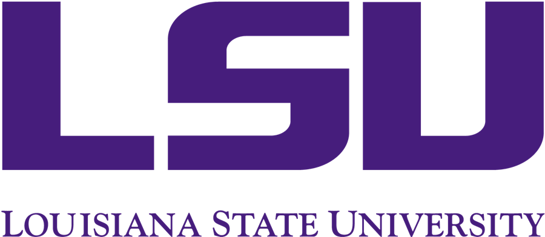

# DeepFE: Deep Learning for Frog Eggs Quantification

In the summer of 2023, Dr. Wolenski and the DeVision team stepped up to the task of aiding LSU's AGGRC lab in their challenge of counting frog eggs. They used machine learning to segment the eggs and count them. They created a Stardist-based model by annotating 180 images and predicted eggs with 99.3% accuracy!

Our team resumed this project with the objective of minimizing the data required to replicate the summer's results. We employed a bottom-up approach by examining egg ranges, categorizing them into groups like 10s, 20s, and so on, up to the 70s. The performance in the lower ranges (10s to 50s) wasn't as successful, but the 60s and 70s ranges yielded slightly better results than those from the summer. Impressively, our team managed to reduce the total number of images required to annotate from 180 to about 20.

# Research done by the Fall 2023 DeVision Team
## CEO
Dr. Peter Wolenski wolenski@math.lsu.edu

## Assistant Professor
Dr. Nadejda Drenska ndrenska@lsu.edu

## Graduate Team Managers:
Iswarya Sitiraju, Gowri Priya Sunkara

## Mathematics Graduate Students:

Ibrahem AlJabea, Christian Ennis, Monika Pandey

## Undergraduate Students:

Finn Phayer, Skylar Wilson

## AGGRC

Director Terrance Tiersch

Assistant Director Prof. Yue Liu

Post Doc Dr. Jack Koch

## The University of Chicago - Marine Biological Laboratory

Research Assistant: Carl Anderson

https://new-www.mbl.edu/
 
 

LSU Math Consultation Clinic: 
https://www.math.lsu.edu/courses/capstone_course
 
 

https://lsu.edu/
